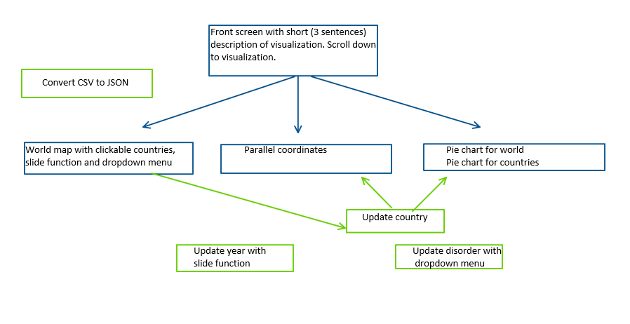

# Design

### Data sources
I will use the DALY estimates from 2000-2015 (4 datasets) from [World Health Organization](http://www.who.int/healthinfo/global_burden_disease/estimates/en/index2.html)
I already filtered the datasets by copy-pasting only the mental disorders
and leaving out the other diseases. I also transposed the rows and columns, so it
is easy to transform the CSV to JSON now.  

### Technical components

### Description components
**csv2jsonConverter:** convert csv data to JSON  
**map:** visualization of the world  
**dropdown menu:** choose disorder  
**slide function:** choose year  
**pie chart:** shows distribution of disorders for world and selected country  
**parallel coordinates:** shows comorbidity between disorders for a country.   
**update disorder:** when chosen a disorder in the dropdown menu, the pie chart, line
graph and map will be updated with the data for the selected disorder. In the pie
chart and parallel coordinates all the disorders are visible, but the line or pie piece for
the selected disorder will light up. The map will be coloured according to the data
for the selected disorder.  
**update year:** when using the slide underneath the map the colours will change
according to the data for that year. Both the pie charts will change for the data
of that year. *optional when still implementing the line graph:* The line in the
line graph will become shorter or longer matching the year that the slide is on.  
**update country:** when clicking on a country the pie chart specific for a country
will change according to the data for that country. The country line in the parallel
coordinates visualization will be more visible.

### D3 plugins
d3.v3  
d3.queue  
d3.tip  
d3.topojson  
