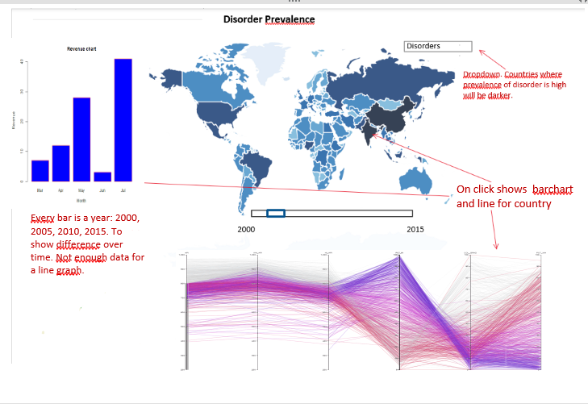

# Project Proposal

**Problem** There is an increase in diagnoses of mental disorders such as depression, autism,
ADHD and more. Often treatments are not sufficient due to a lack of understanding what these
disorders really are. Because of this many people struggle with these disorders for a long time.  

**Solution** To prevent/treat a disorder it is essential to understand the disorder. An
overview of disorder prevalence over the world can help in better understanding the disorder
and finding possible causes for the increase in diagnoses.

## Features
**Dropdown menu:** depressive disorder, bipolar disorder, schizophrenia, alcohol/drugs
use disorder, anxiety disorder, eating disorder, autism, ADHD  
**Slide function:** 2000, 2005, 2010, 2015  
**On click (map):** select a country, all countries on the map where data is available

***Optional***   
**Choose sex:** female, male, both (button?)  
**Choose age:** 0-4, 5-14, 15-29, 30-49, 50-59, 60-69, 70 (Dropdown?)
**On hover (map):** show country disorder information   
**On hover (line graph):** show more information for line

## Prequisitions
**Data source**: I will use the DALY data for 2000, 2005, 2010 and 2015. DALY is a measurement of
the gap between current health status and an ideal health situation. The data has to be converted
from csv to json. [World Health Organization - Disease Burden 2000-2015](http://www.who.int/healthinfo/global_burden_disease/estimates/en/index2.html)  
**External components**: d3-tip, topojson, bootstrap  
**Similar visualizations**: This visualization shows the number of psychiatrists
working in mental health based on population size. This is a related subject to my project (would
also be an interesting comparison) and they also use some features that I can use.
To show the prevalence of mental disorders I can use a world map as well coloured
on prevalence. I also want to use a pie chart to show the distribution of different
disorder per country. [Psychiatrists Visualization](http://gamapserver.who.int/gho/interactive_charts/mental_health/psychiatrists_nurses/atlas.html)  
**Hardest parts**: I think it might be difficult to fit everything on the right place on the page.
Also the interactive part might be a bit difficult. The hardest part I find to write a nice
clean code, without using the same code more than once.
