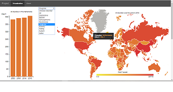
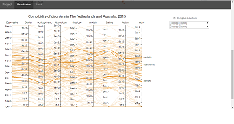

Go to the page: [Disorder Prevalence](https://10588094.github.io/project/project.html)  
Made by: Daphne Witmer

## Disorder Prevalence
This project gives an overview of disorders over the world. The map gives an insight in the prevalence of disorders in different countries. The bar chart shows the changes over time for specific countries.

The parallel coordinates shows the comorbidity between disorders.

## Acknowledgements
Libraries used: 
All disorder data used in the visualizations comes from: [World Health Organization](http://www.who.int/healthinfo/global_burden_disease/estimates/en/index2.html)  
The JSON file to build the d3 map comes from:  [topojson](https://raw.githubusercontent.com/deldersveld/topojson/master/world-countries.json)  
The image for the frontpage in the doc folder comes from: [image](https://res.cloudinary.com/jerrick/image/upload/c_fit,f_auto,fl_progressive,q_auto,w_1100/ohihozl5orbkz6czgegk)
