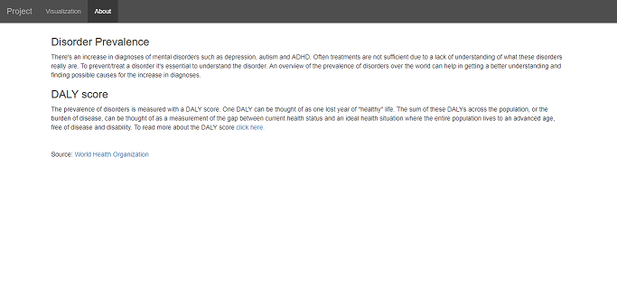

Go to the page: [Disorder Prevalence](https://10588094.github.io/project/project.html)  
Product demo: [YouTube - Disorder Prevalence](https://www.youtube.com/watch?v=LARbVmHfugo&feature=youtu.nl)
Made by: Daphne Witmer

## Disorder Prevalence
There is an increase in diagnoses of mental disorders such as depression, autism and ADHD. This project gives an overview of disorder prevalence over the world and might help to get a better understanding in the causes and maintaining factors of mental disorders.

The map gives an insight in the prevalence of disorders in different countries, the bar chart shows the changes over time for specific countries and the parallel coordinates shows the comorbidity between disorders.

It is possible to choose different countries, disorders and years, either by clicking on the map or bar chart or by choosing an option from the dropdown menu.

The data is based on DALY score (Disability-Adjusted Life Year), more information about the project and DALY score can be found on the 'About' tab.

## Acknowledgements
Libraries used: d3.v3, topojson, bootstrap, jquery
Data source for data on disorders: [World Health Organization](http://www.who.int/healthinfo/global_burden_disease/estimates/en/index2.html)  
JSON file to build the d3 map:  [topojson](https://raw.githubusercontent.com/deldersveld/topojson/master/world-countries.json)  
Image for the frontpage in the doc folder: [image](https://res.cloudinary.com/jerrick/image/upload/c_fit,f_auto,fl_progressive,q_auto,w_1100/ohihozl5orbkz6czgegk)

Copyright (c) 2018, Daphne Witmer. Released under the GNU General Public License. All rights reserved
